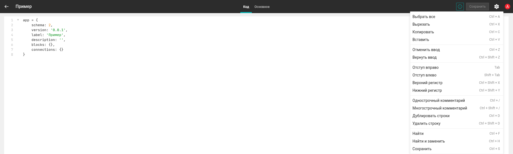
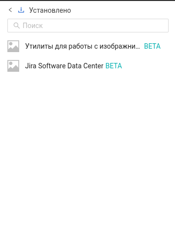
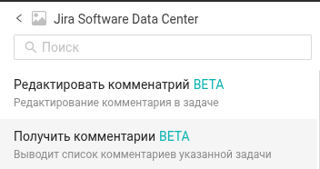

import DocCard from '@theme/DocCard';

# Быстрый старт

## Шаг 1: Установка NodeJS

```bash title="Установка на Ubuntu"
sudo apt update

sudo apt install nodejs
```
```bash title="Установка на Windows"
powershell -c "irm https://community.chocolatey.org/install.ps1|iex"

choco install nodejs --version="24.13.0"
```

```bash title="Проверка версии"
node -v
```
```bash title="Вывод версии"
24.13.0
```
## Шаг 2: Инициализация репозитория

```bash title="Вывод версии"
npx @infomaximum/package-cli integration init my_integration
```
Где `my_integration` — имя создаваемой директории, в которой инициализирован проект интеграции.

После выполнения команды создается шаблонный проект и инициализируется git-репозиторий.
:::note
Если git репозиторий уже создан, то он просто переинициализируется
:::

:::tip
Вместо `my_integration` можно указать . — тогда проект интеграции будет создан в текущей директории.
:::
## Шаг 3: Добавление первого блока и подключения

<details>
<summary>Пример функционального блока</summary>
```js
export const getAllScripts: IntegrationBlock<
  { onlyActive: boolean },
  ICommonAuthData
> = {
  label: "Получить все скрипты в системе",
  description: "Блок получает все скрипты в системе",
  inputFields: [
    {
      key: "onlyActive",
      type: "boolean",
      label: "Только активные скрипты",
      default: true,
    },
  ],
  executePagination: (service, bundle, _context) => {
    if (!bundle.authData || !bundle.authData.url) {
      service.stringError("Отсутствует подключение.");
    }
    const explorer = new GraphQLClient(service);
    const response = explorer.query<IApiResponse>(
      bundle.authData.url,
      `query {
        automation {
          script {
            script_general_list {
              items {
                element {
                  id
                  name
                  enabled
                }
              }
            }
          }
        }
      }`
    );

    const items = response.data?.automation.script.script_general_list.items ?? [];

    const output = items.reduce<TNormalizedItem[]>((acc, { element }) => {
      if (element.name.includes("_DISABLE_")) {
        return acc;
      }

      if (bundle.inputData.onlyActive && !element.enabled) {
        return acc;
      }

      acc.push([element.id, element.name, element.enabled]);
      return acc;
    }, []);

    const outputVariables: OutputBlockVariables[] = [
      { type: "Long", name: "id" },
      { type: "String", name: "name" },
      { type: "Boolean", name: "enabled" },
    ];

    return {
      output,
      output_variables: outputVariables,
      state: undefined,
      hasNext: false,
    };
  }
}
```
</details>

<details>
<summary>Пример блока подключений</summary>
```js
import { IntegrationConnection } from "@infomaximum/integration-sdk";
import { ICommonAuthData } from "../types/connections";

export const basicConnect: IntegrationConnection<ICommonAuthData> = {
  label: "Подключение по ApiKey",
  description: "Подключение по ApiKey",
  inputFields: [
    {
      key: "connection_apiKey",
      type: "text",
      label: "API-ключ",
    },
    {
      key: "connection_host",
      type: "text",
      label: "Хост",
    },
    {
      key: "connection_port",
      type: "text",
      label: "Порт ",
    },
    {
      key: "host_button",
      type: "button",
      label: "Автоопределение хоста",
      typeOptions: {
        saveFields: (service, bundle) => {
          const preparedHost = bundle.authData.BASE_URL.replace(
            /^https?:\/\//,
            ""
          ).replace("/webhook/" + bundle.authData.GUID, "");

          const [host, port = ""] = preparedHost.split(":");

          return {
            connection_host: host,
            connection_port: port,
          };
        },
      },
    },
  ],
  execute: (service, bundle) => {
    function createUrl(host: string, port: string, apiKey: string): string {
      const hasProtocol = /^https?:\/\//.test(host);
      const base = hasProtocol ? host : `http://${host}`;

      if (!port || port === "0") {
        return `${base}/graphql?api_key=${apiKey}`;
      }
      return `${base}:${port}/graphql?api_key=${apiKey}`;
    }

    return {
      apiKey: bundle.authData.connection_apiKey,
      host: bundle.authData.connection_host,
      port: bundle.authData.connection_port,
      url: createUrl(
        bundle.authData.connection_host,
        bundle.authData.connection_port,
        bundle.authData.connection_apiKey
      ),
    };
  },
  refresh: () => {
    /*Empty*/
  },
};

```
</details>

## Шаг 4: Добавления блока и подключения в структуру интеграции


<details>
<summary>index.ts</summary>
```js
import { basicConnect } from "./connections/connections";
import { getAllScripts } from "./modules/scripts/getAllScripts";

app = {
  schema: 2,
  version: "3.0.0",
  label: "Proceset",
  description: "",
  blocks: {
    getAllScripts,
  },
  connections: { basicConnect },
};
```
</details>

## Шаг 5: Сборка

```bash title="Сборка интеграции"
yarn dev
```
Запускает сборку скрипта интеграции с последующим отслеживанием изменений в файлах и автоматической пересборкой

Сборка будет в папке build

## Шаг 6: Добавление интеграции в систему proceset

Чтобы создать собственную интеграцию в Proceset, выполните следующие шаги:

### Шаг 1: Создать интеграцию

В Панели управления в пространстве нажмите `+Добавить` и выберите `Интеграцию`.


### Шаг 2: Указать параметры
В открывшемся окне укажите следующие параметры:
- Название интеграции
- Логотип — загрузите иконку системы, с которой будет сделана интеграция, в формате .svg
- Описание (необязательно)


- Нажмите создание

### Шаг 3: Добавить код

После добавления интеграции в пространство автоматически откроется редактор кода, в который нужно выставить код из сборки



### Шаг 4: Создать скрипт

По аналогии с шагом 1 и 2,нужно создать скрипт и указать параметры

### Шаг 5: Добавить блок интеграции

Требуется выбрать пункт `Установлено'


Затем выбрать  интеграцию 



Затем выбрать блок



import React, { useEffect, useRef } from "react";

export const NeonButton = ({ children = "Открыть документацию" }) => {
  const buttonRef = useRef(null);

  useEffect(() => {
    const btn = buttonRef.current;
    let hue = 200; // базовый синий
    const animate = () => {
      hue = (hue + 0.5) % 360;
      const glow = `0 0 10px hsl(${hue}, 100%, 70%), 0 0 20px hsl(${hue}, 100%, 60%), 0 0 40px hsl(${hue}, 100%, 50%)`;
      btn.style.boxShadow = glow;
      btn.style.borderColor = `hsl(${hue}, 100%, 60%)`;
      requestAnimationFrame(animate);
    };
    animate();
  }, []);

  return (
    <span
      ref={buttonRef}
      onClick={() => window.open("https://infomaximum.ru/docs", "_blank")}
      style={{
        display: "inline-block",
        padding: "14px 32px",
        borderRadius: "25px",
        fontWeight: "600",
        letterSpacing: "0.5px",
        color: "#00ffff",
        textShadow: "0 0 6px #00ffffaa",
        border: "2px solid #00ffff",
        cursor: "pointer",
        background: "linear-gradient(145deg, #001427, #002b55)",
        transition: "transform 0.2s ease, box-shadow 0.3s ease, color 0.3s ease",
        userSelect: "none",
      }}
      onMouseEnter={(e) => {
        e.target.style.transform = "scale(1.08)";
        e.target.style.color = "#ffffff";
      }}
      onMouseLeave={(e) => {
        e.target.style.transform = "scale(1)";
        e.target.style.color = "#00ffff";
      }}
    >
      {children}
    </span>
  );
};

:::tip
Подробная информация как работать с proceset   <NeonButton color="#0e7fbcff">Жмак</NeonButton>